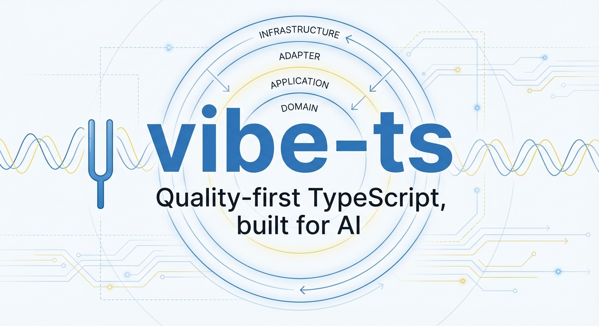
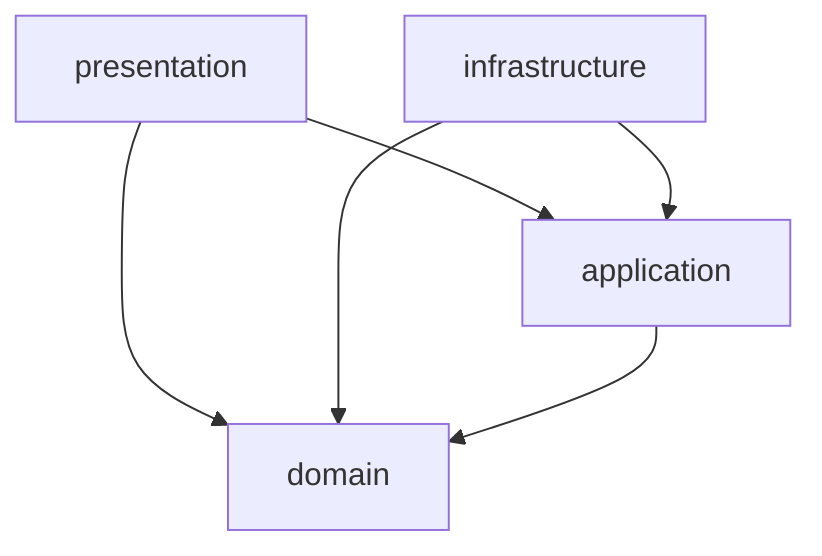

# vibe-ts

<picture>
  <source media="(prefers-color-scheme: dark)" srcset="assets/banner.dark.png" />
  <source media="(prefers-color-scheme: light)" srcset="assets/banner.light.png" />
  
</picture>

Quality-first TypeScript template for AI-assisted development. DDD architecture with enforced boundaries, mutation testing, and comprehensive linting.

## Quick setup

1. Click "Use this template" on GitHub (or clone directly).
2. Search and replace `vibe-ts` with your project name in `package.json`.
3. Run `npm install`.
4. Run `npm run ci` to verify everything passes.
5. Delete the sample code in `src/domain/greeting/`, `src/application/greet/`,
   and `src/infrastructure/adapters/in-memory-greeting-repository.ts`.
6. Start building your domain in `src/domain/`.

### Fast install + Bun support

- Default path: `npm install`
- Fast CI-friendly install: `npm run install:fast`
- Bun-accelerated local workflow:
  - `bun install`
  - `bun run ci:fast` (for fast checks), then `npm run ci` (full gate) when needed
- pnpm users can still run `corepack pnpm install` manually; repo layout already supports workspace workspaces.

### Quality guardrail checks

- Run `npm run agent:verify` to smoke-test hook bypass protections and required policy settings.
- This checks that `--no-verify`, `SKIP_CI`, and hook bypass env flags (like `HUSKY=0` / `HUSKY_SKIP_HOOKS`) are blocked.
- Remote enforcement is in `.github/workflows/guardrails.yml`; to fully prevent policy bypass on mainline history, enable branch protection rules in GitHub:
  - Require pull requests before merging to the default branch
  - Require status checks: `quality`, `guardrails`
  - Disallow force pushes and stale out-of-date branch merges
  - For strict mode, require administrator review and CODEOWNERS approval where appropriate
- Enforce the same policy from shell/CI with:
  - `npm run admin:branch-protection` (verify remote protection settings)
  - `npm run admin:branch-protection:apply -- --repo owner/repo --branch main` (apply and normalize in CI automation)
    - requires `GH_TOKEN`/`GITHUB_TOKEN` with repository admin permissions on branch protection APIs
  - Use `workflow_dispatch` on `.github/workflows/branch-protection.yml` to apply from GitHub UI:
    - `apply=true`, optional `branch`, `contexts`, and `approvals` inputs.

## Architecture

This project follows Domain-Driven Design with enforced layer boundaries:

```
src/domain/          Pure business logic. Zero external dependencies.
src/application/     Use cases and port interfaces. Depends only on domain.
src/infrastructure/  Adapters for external systems. Implements ports.
src/presentation/    HTTP routes, CLI, or UI. Entry points.
```

Dependencies flow inward only:



These boundaries are enforced at build time by dependency-cruiser. A domain file importing from infrastructure will fail CI.

## Quality gates

| Gate             | Command                 | When          |
| ---------------- | ----------------------- | ------------- |
| Type check       | `npm run typecheck`     | pre-push      |
| Lint             | `npm run lint`          | pre-commit    |
| Format           | `npm run format:check`  | pre-commit    |
| Spelling         | `npm run spell`         | pre-commit    |
| Architecture     | `npm run depcruise`     | CI            |
| Dead code        | `npm run knip`          | CI            |
| Unit tests       | `npm run test:coverage` | CI            |
| Mutation testing | `npm run mutation`      | nightly       |
| Security audit   | `npm run audit:high`    | CI            |
| **All gates**    | **`npm run ci`**        | **pre-merge** |

## Adding a new feature

1. Define the entity or value object in `src/domain/`. Use branded primitives for IDs.
2. Define the port (interface) in `src/application/ports/`.
3. Write the use case in `src/application/`. It depends only on ports and domain.
4. Implement the adapter in `src/infrastructure/adapters/`. Start with an in-memory double.
5. Wire it in `src/presentation/` (HTTP route, CLI command, etc.).
6. Write colocated `.test.ts` files at every layer.

## Working with AI assistants

This template includes a `CLAUDE.md` file that teaches AI coding assistants to follow the project's architecture and quality standards. The `.claude/` directory includes:

- **settings.json** -- permission boundaries (blocks reading secrets, force push)
- **hooks/pre-tool-use.sh** -- blocks `--no-verify` and `SKIP_CI` bypass attempts
- **skills/** -- reusable quality check, architecture guard, and review workflows

## Customizing thresholds

All thresholds are in config files you own:

- **Complexity limits**: `eslint.config.mjs` (complexity, max-depth, max-lines-per-function, etc.)
- **Coverage minimums**: `vitest.config.ts` (per-layer thresholds)
- **Mutation score**: `stryker.conf.json` (high/low/break thresholds)
- **Architecture rules**: `.dependency-cruiser.cjs` (forbidden dependency patterns)

Start with the defaults. Tighten them as your codebase matures.

## Adding E2E tests (optional)

If your project includes a web UI:

1. `npm install -D @playwright/test`
2. `npx playwright install chromium`
3. Create `e2e/` directory and `playwright.config.ts`
4. Add to eslint.config.mjs ignores: `'e2e/**'`
5. Add npm scripts: `test:e2e`, `e2e:install`

## AI agent swarm mode

You can run multiple agents in parallel using the Beads + AGENT workflow:

- `npm run agent:context` prints repository state, open issue health, and next actions.
- `npm run agent:seed-issues` seeds a default bootstrap issue backlog from `scripts/agent/bootstrap-plan.json`.
- `npm run agent:spawn -- --agents "agent-alpha,agent-beta,agent-gamma"` starts a team plan.
  - Add `--assign` (explicit/default) to auto-start issues and create `.trees/<id>` worktrees.
  - Add `--no-assign` to just print commands for human/manual claiming.
  - Add `--no-seed` if you want to seed issues separately.
  - Claims are pushed to the repository's default remote branch (resolved from `origin/HEAD`).
- `npm run agent:handoff -- --issue <id> --to <agent-name> --note "<message>"` hands off ownership between agents.
- `npm run agent:context --json` and `npm run bd -- issue next --json` are the machine-readable context outputs.

You can also use:

- `create-vibets --agents "agent-alpha,agent-beta"` (alias for `npm run agent:spawn`) from a shell.

Suggested loop:

1. Seed issues if needed: `npm run agent:seed-issues`.
2. Spawn team: `npm run agent:spawn` (auto-assigns by default, or add `--no-assign` for planning mode).
3. Each agent runs the AGENT loop from their claimed worktree.

## License

MIT
